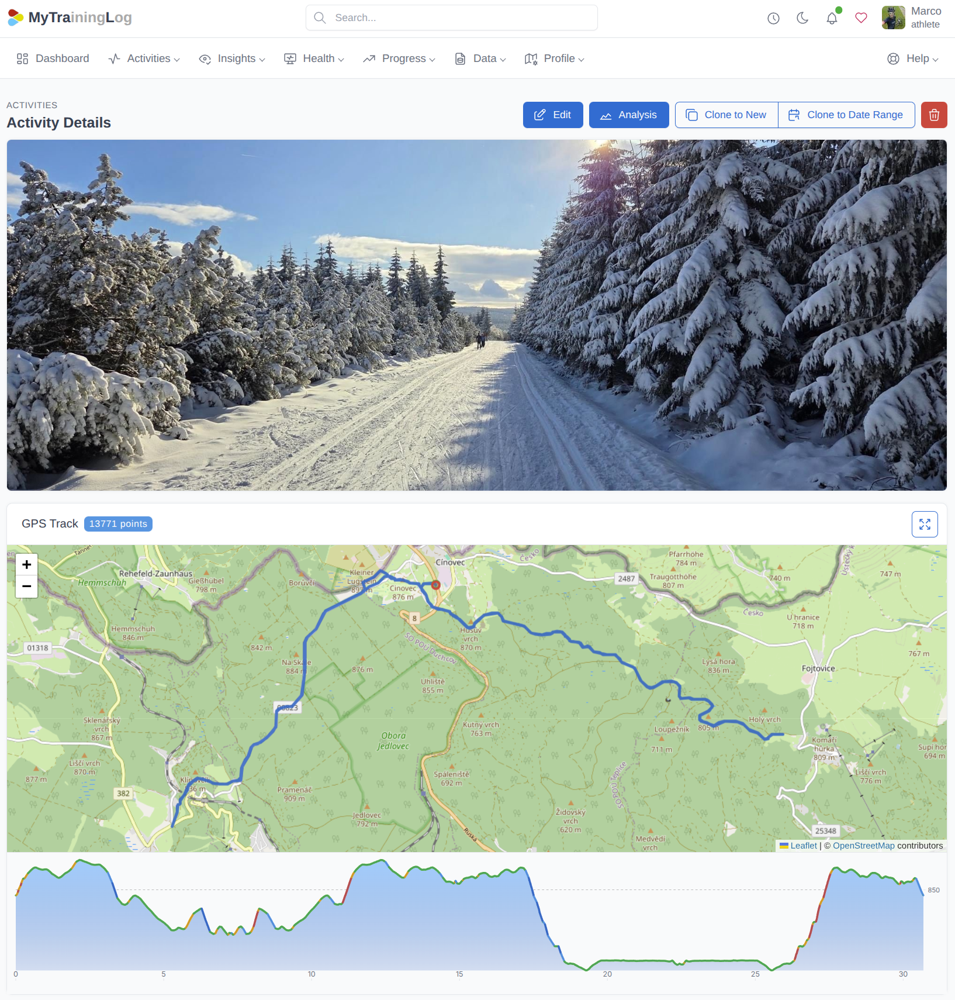

# MyTraL: My Training Log

**My** **Tra**ining **L**og (MyTraL) is my sovereign athlete personal training log for deeper insights and smarter progress.

## Contribute

Contribute! See [CONTRIBUTE.md](./CONTRIBUTE.md). Don't hesitate to contact me - I will be happy to talk!

## Bugs

https://github.com/dvorka-oss/mytral/issues
