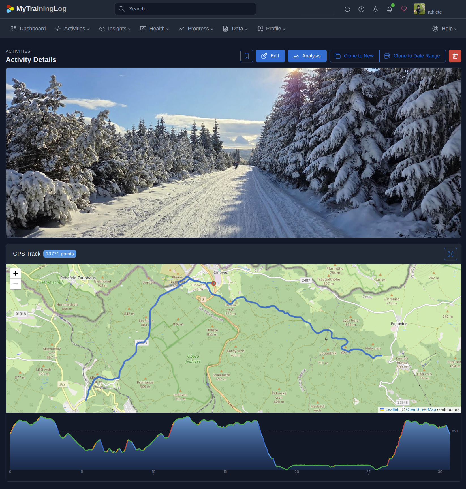

# MyTraL: My Training Log

<!--  -->
<!--  -->
<!--  -->

Are your sports data scattered across the services and systems you’ve used over the
years - FIT, GPX, TCX files, Strava™, Garmin™, Polar™, Concept2™, Microsoft™ Excel™ or
even paper logs? Are you afraid that you could lose access to your data seized by
someone else? Are you worried that your favorite sport platform might sunset or
paywall your history? Are you fed up with sport apps selling your data habits to
third-party advertisers? Do you believe that **privacy is your right**, not a privilege?

Would you like to own your sport data again to see all the workouts you've done over the
years in one single application on your desktop?

**MyTraL** is a personal training log.

https://mytral.mindforger.com

Every day, people lose access to accounts containing years of personal data - banned
without explanation, locked out without recourse, legal terms changed without notice.
Let your data live on your machine, under your control. Always accessible, always yours.
Your log, your data, your edge. Track, analyze, understand, and optimize to achieve your
goals with MyTraL.

## The Story of MyTraL

MyTraL was born from a simple need - to track my own training progress with more depth and insight than existing solutions offer.
The data from my sports diaries tells the story of my life as a formerly competitive, now recreational athlete.
In this project, I'm building and documenting the software chain to digitize and normalize 30+ years of diverse training logs I have used over the years - from paper (official performance sports center diaries and my personal notebooks) and spreadsheets to third-party online and desktop tools, Concept2 ranking, all the way to social fitness networks.
What will I learn from the data? I can't wait! What about you?

## Manifesto

**No Silver Bullets**

Track your activities day by day, week by week, month by month, year by year. There are no silver bullets and no shortcuts - just consistent effort over time.

**Data Ownership**

Privacy is your right, not a privilege. Every day, people lose access to accounts containing years of personal data - banned without explanation, locked out without recourse, legal terms changed without notice. Let your data live on your machine, under your control. Always accessible, always yours.

**Perfect Software**

Software, like coffee, is a matter of personal ritual and objective taste. One athlete seeks the bitterness of a dark roast. Another, the clarity of a light pour-over. To force the same cup on everyone is not "user experience" - it is a compromise.
Mytral is designed to be customized, not just used. It provides the raw beans, the temperature control, and the grind - you decide the extraction. True Perfect Software is a mirror of the individual. It is the version that is perfect for you specifically. Your fitness journey is unique. The tool you use to track it should be as tailored as your own morning brew.

**Freedom**

Digital sovereignty is a fundamental right, which is why MyTraL embraces the FLOSS principles. MyTraL provides you the four essential freedoms: the freedom to run the software for a good purpose, to study and change its source code so it truly serves your fitness goals, to redistribute copies to help others, and to distribute modified versions so the entire athlete community benefits from collective improvements.
From the transparent development process to underlying algorithms, everything is open to audit. There are no hidden "black box" metrics, no backdoors, no tracking, or proprietary secrets.

**Open Data Formats**

Your training history is a lifetime asset that deserves to stand the test of time. MyTraL stores your progress using transparent, human-friendly open data format standards, ensuring your records remain accessible and readable forever. By avoiding "black box" storage, it guarantees the freedom to move your history anywhere or plug it into other tools. You can run your own post-processing scripts, build personal machine learning models to predict whatever you need, or visualize your progress in ways that fit your specific needs.

## Installation

Install:

* [Linux (Snap Store)](INSTALLATION.md#install-on-linux-using-snap-from-snap-store)
* [Linux (Snap download)](INSTALLATION.md#install-on-linux-using-snap)
* [Linux (Flatpak)](INSTALLATION.md#install-on-linux-using-flatpak)
* [Ubuntu (PPA)](INSTALLATION.md#install-on-ubuntu-from-ppa)
* [Windows (installer)](INSTALLATION.md#install-on-windows-using-installer)
* [Windows (zip)](INSTALLATION.md#install-on-windows-using-zip)
* [Windows (winget)](INSTALLATION.md#install-on-windows-using-winget)
* [macOS (dmg)](INSTALLATION.md#install-on-macos-using-dmg)

Build:

* [Snap (package)](INSTALLATION.md#build-snap-on-linux)
* [Flatpak (bundle)](INSTALLATION.md#build-flatpak-on-linux)
* [Ubuntu (binary)](INSTALLATION.md#build-binary-on-ubuntu)
* [Ubuntu (deb)](INSTALLATION.md#build--deb-on-ubuntu)
* [Windows (binary)](INSTALLATION.md#build-binary-on-windows)
* [Windows (installer)](INSTALLATION.md#build-windows-installer)
* [macOS (dmg)](INSTALLATION.md#build-macos-dmg)

Run:

* [Run using Python on Ubuntu](INSTALLATION.md#run-using-python-on-ubuntu)
* [Run using Docker on Debian](INSTALLATION.md#run-using-docker-on-debian)
* [Run using Docker on Fedora](INSTALLATION.md#run-using-docker-on-fedora)

Tarball:

* [Download and install tarball](INSTALLATION.md#download-and-install-tarball)

## Bugs and Feature Requests

https://github.com/dvorka/mytral/issues
