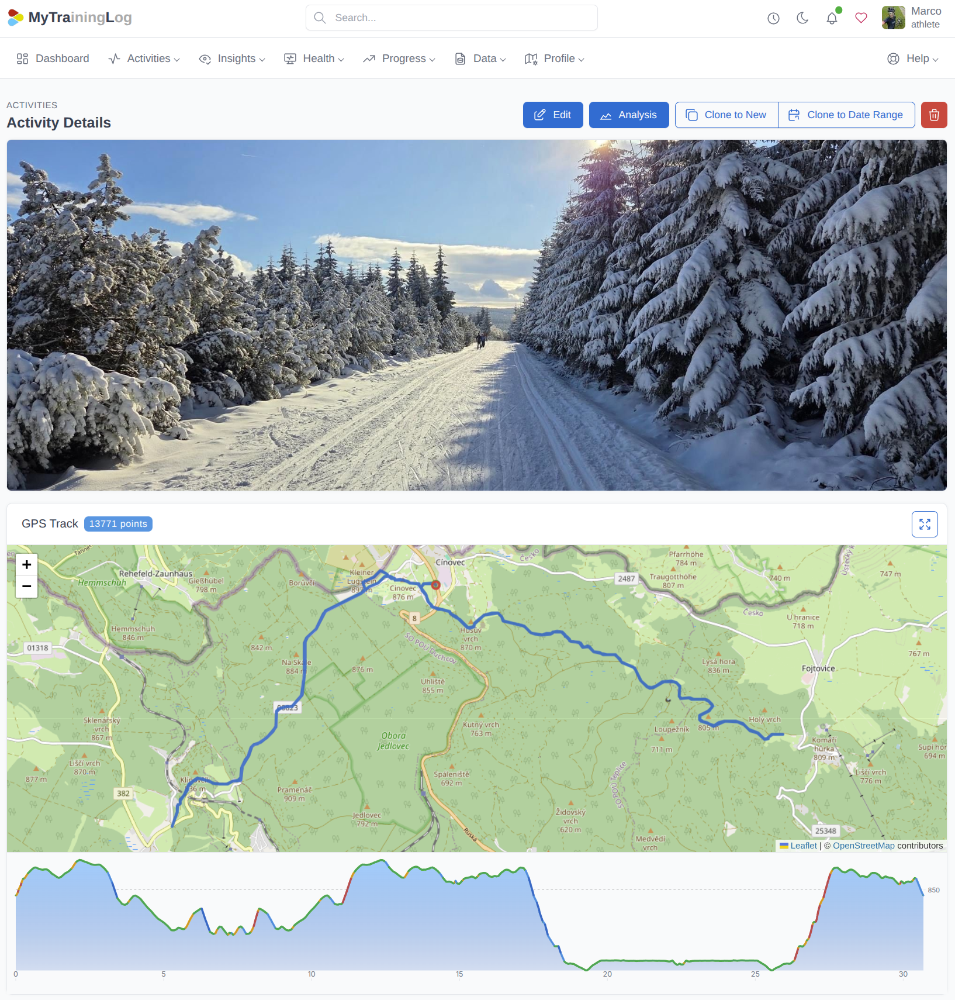

# MyTraL: My Training Log

<!--  -->
<!--  -->
<!--  -->

**My** **Tra**ining **L**og (MyTraL) is my personal training log for deeper insights and smarter progress.

## Installation

Install:

* [Linux (Snap Store)](INSTALLATION.md#install-on-linux-using-snap-from-snap-store)
* [Linux (Flatpak)](INSTALLATION.md#install-on-linux-using-flatpak)
* [Linux (download)](INSTALLATION.md#install-on-linux-using-snap)
* [Ubuntu (PPA)](INSTALLATION.md#install-on-ubuntu-from-ppa)
* [Windows (installer)](INSTALLATION.md#install-on-windows-using-installer)
* [Windows (zip)](INSTALLATION.md#install-on-windows-using-zip)
* [Windows (winget)](INSTALLATION.md#install-on-windows-using-winget)
* [macOS (dmg)](INSTALLATION.md#install-on-macos-using-dmg)

Build:

* [Snap (package)](INSTALLATION.md#build-snap-on-linux)
* [Flatpak (bundle)](INSTALLATION.md#build-flatpak-on-linux)
* [Ubuntu (binary)](INSTALLATION.md#build-binary-on-ubuntu)
* [Ubuntu (deb)](INSTALLATION.md#build--deb-on-ubuntu)
* [Windows (binary)](INSTALLATION.md#build-binary-on-windows)
* [Windows (installer)](INSTALLATION.md#build-windows-installer)
* [macOS (dmg)](INSTALLATION.md#build-macos-dmg)

Run:

* [Run using Python on Ubuntu](INSTALLATION.md#run-using-python-on-ubuntu)
* [Run using Docker on Debian](INSTALLATION.md#run-using-docker-on-debian)
* [Run using Docker on Fedora](INSTALLATION.md#run-using-docker-on-fedora)

Tarball:

* [Download and install tarball](INSTALLATION.md#download-and-install-tarball)

## Contribute

Contribute! See [CONTRIBUTE.md](./CONTRIBUTE.md). Don't hesitate to contact me - I will be happy to talk!

## Bugs and Feature Requests

https://github.com/dvorka-oss/mytral/issues
