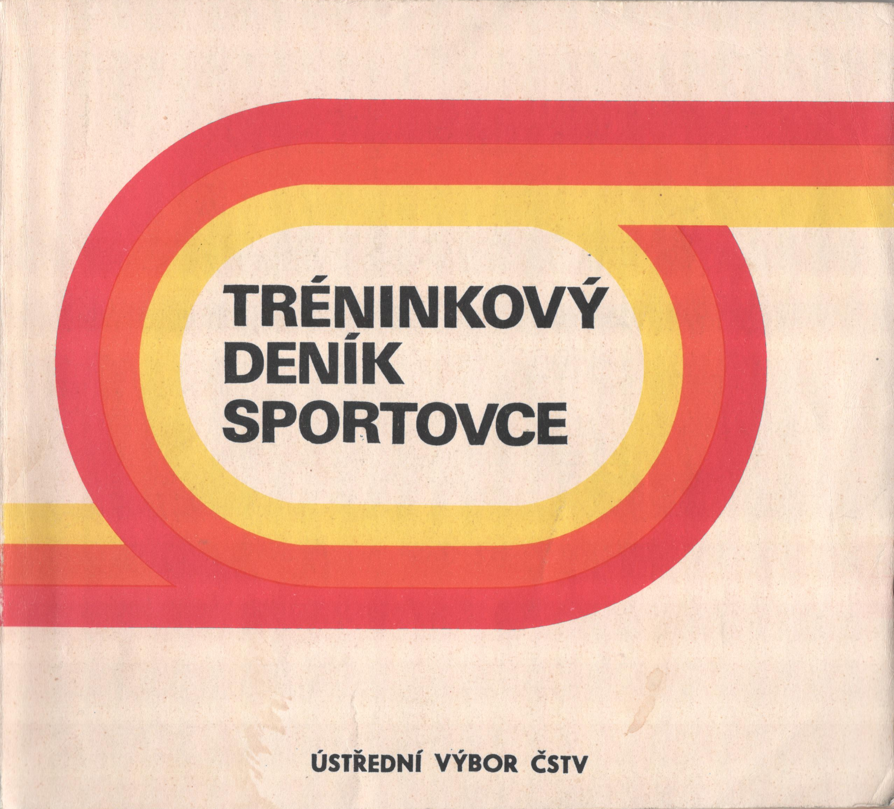
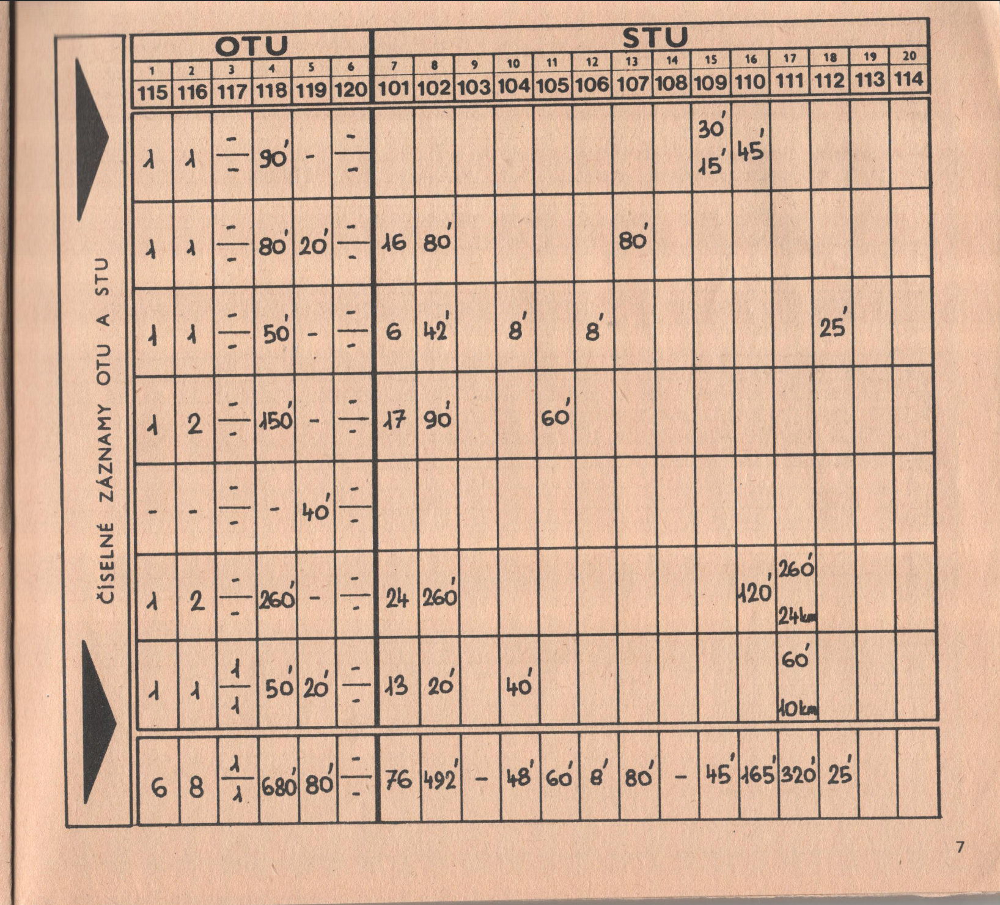
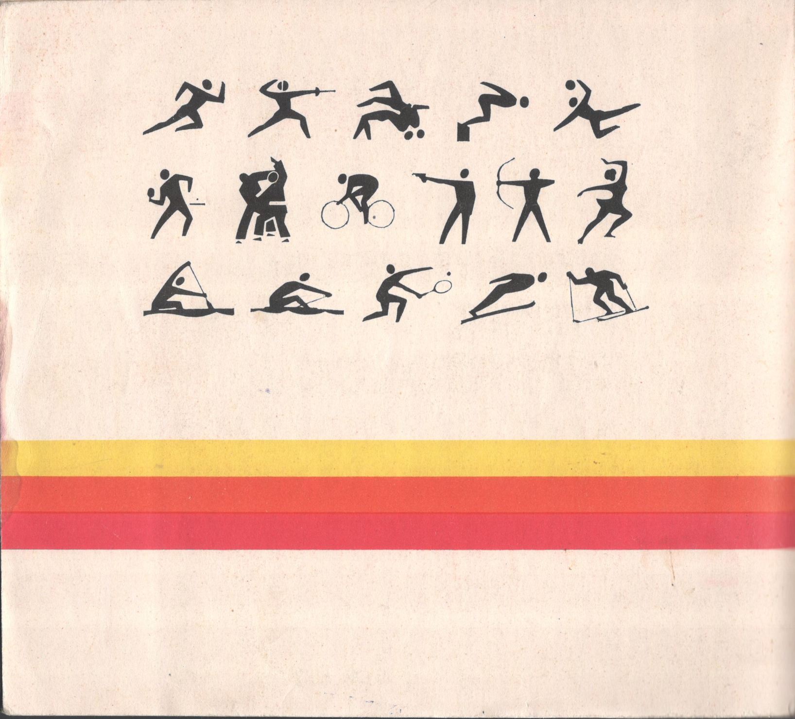

# Digitize, normalize, own!

## Why?

MyTraL was born from a simple need: to track my own training progress with more depth and insight than existing solutions offered. I was born a sickly child who struggled with overweight and illness in the first years of my life. Thanks to sports, however, I overcame the problems, found friends, and my life became much happier. The data from my sports diaries tell the story of one recreational athlete's life. From nothing to a national rowing champion and a marathon under 3 hours.

## Digitize, normalize, own!

I believe that **privacy is normal**. Everyone should own their personal data - I want to keep my training history and my very personal insights under my own control. This is why I'm building MyTraL - to have complete ownership of data, [normalized](normalization.html) in an **open format** , and analyze it myself, without relying on third-party platforms.

In this project, I am documenting the process of digitization and normalization of 30+ years of training logs I have used over the years — from paper (official performance sports center diaries, my personal notebooks), MS Excel, 3rd party online diaries, [concept2.com ranking](https://www.concept2.com/online-rankings), [Google Sheets](https://workspace.google.com/products/sheets/), all the way to [strava.com](https://www.strava.com/).

What all will I learn from the data? I can't wait!

## TSM/SVS Logs (1986 - 1994)

The story began in 1986. During the summer holidays that year, my father told me he insisted I choose a sport — any sport. I somehow expected the idea would disappear, but it didn't. One day, while watching the intro to a daily program about what's new in sports, I became interested in rowers. By coincidence, my father knew a colleague from work who was a coach at the local rowing club. So, with the start of the school year, I joined the club and began to row.

I was born in a country with a communist regime, but which had a quite sophisticated system for working with children and youth in sports. The reason was that sport was used in propaganda for comparison as to which regime was better - Western capitalism or communism (socialism).

The backbone of the youth development system for children was the sports centers - TSM (Tréninkové Středisko Mládeže - Youth Training Center) for children from 10 to 14 years old (older and younger pupils, each for 2 years) and SVS (Středisko Vrcholového Sportu - Center for Elite/High-Performance Sports) for children from 15 to 18 years old (youth and juniors, each for 2 years). With that, and then the national representation (team) followed.

After about a year or two, I made it to TSM. That's when I got **my first training log** , which I had to fill out daily.

These paper logs contain detailed methodology instructions, training notes, performance observations, and personal reflections from my early competitive years. Training data were periodically checked by the center head coach who was supervising the coach of my category. This ensured consistency and accountability in my training. The head coach would review my entries montly, providing honest feedback.

As teenager I hated it and I didn't understand why had to do that - most of the time I considered it the waste of time. It felt like a chore rather than a tool for improvement. That changed, however, when I ended my career as an elite athlete, took a break from sports, and started having my own ambitions - such as a sub-3 hour marathon.

It was mandatory to return the training diaries to the training center at the end of the season (which ended at the end of the summer holidays), but for some reason I no longer remember, the last diary with only a few entries remained with me - most likely because I finished in November (at the beginning of new season). I erased the old entries from it, and for the first year as a recreational runner, I used it and only then truly appreciated how well-made it was.

## Microsoft Excel training log (1996 - 2000)

I used Microsoft Excel as log in the past...

* The first approach: .xls > .csv > Python import > MyTraL
* The second approach: .xls + .json example > LLM > .json

## Paper Notebooks (1996 - 2009)

I used paper training notebooks in the past...

## Concept2 Online Log (2009 - 2020)

I used Concept2 Online Log in the past...

## Google Sheets (2010 - 2024)

I used Google Sheets as training log in the past...

## Strava (2013 - onwards)

I use Strava as training log...
